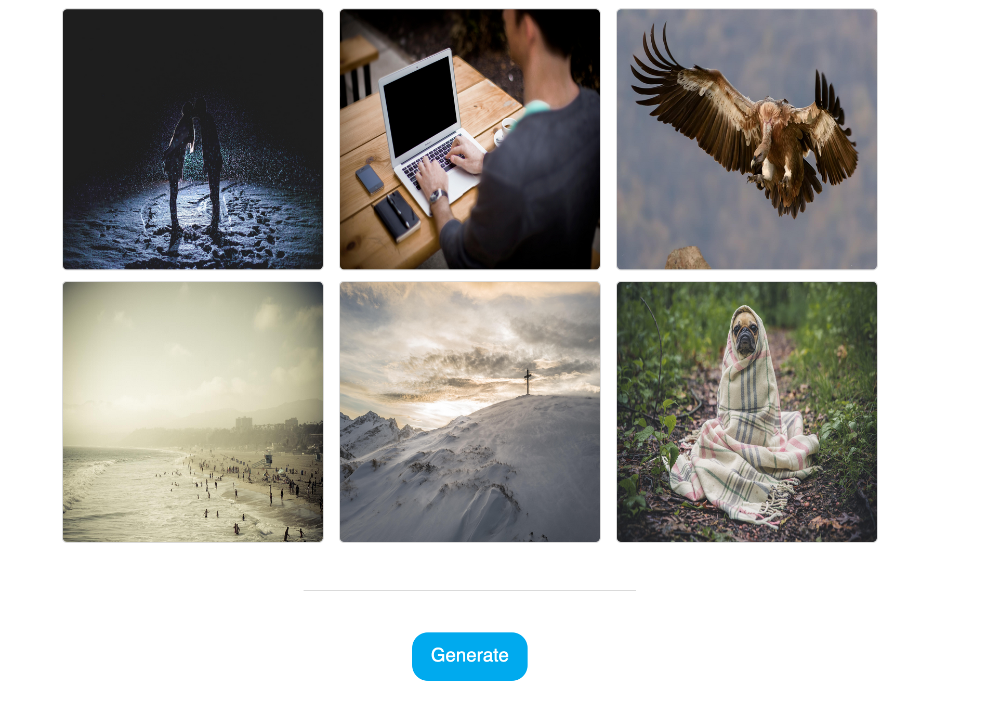

# Random image gallery
We're building a simple gallery application with a button that generates new random images

### Requirements:
* Gallery of images + button should be displayed on the page
* On click of a button - new images get generated

CSS tips:
* Main container is responsive and has a max of 800px
* 2-3 rows 3 images each (when on Desktop viewport)
* When screen is `< 600px` main container becomes full-width
* Font is Helvetica/sans-serif
* Font size is 18px
* Blue colour is `#00aaee`, grey is `#dadada`

### API's to use: 
* Photos: https://picsum.photos
* Quotes: https://forismatic.com/en/api/

### [Bonus round](./BONUS.md)
